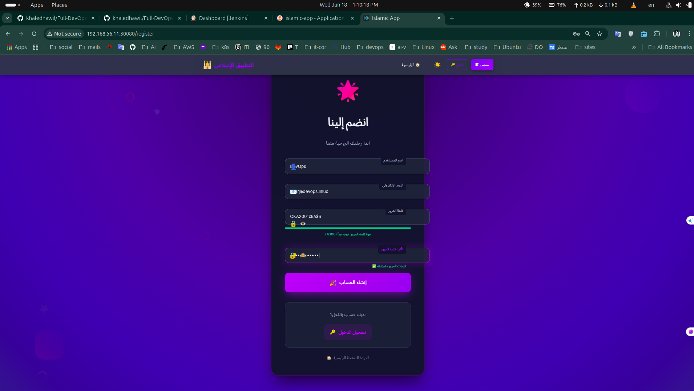

# Islamic App - Full-Stack Application with Enterprise DevOps

[](https://jenkins.yourdomain.com)
[](https://hub.docker.com/u/khaledhawil)
[](https://k8s.io)
[](https://argoproj.github.io/cd/)


A production-ready Islamic application built with modern full-stack technologies and enterprise-grade DevOps practices. This project demonstrates comprehensive CI/CD automation, containerization, Kubernetes orchestration, and GitOps deployment methodologies while serving the Muslim community with essential digital Islamic tools.

## Developer Information

**Khaled Hawil**
- GitHub: [@khaledhawil](https://github.com/khaledhawil)
- Email: khaledhawil91@gmail.com
- LinkedIn: [khaledhawi](https://linkedin.com/in/khaledhawil)
- Portfolio: DevOps Engineer

## Project Overview

The Islamic App is a full-stack web application that combines traditional Islamic resources with cutting-edge technology to provide an accessible platform for worship, learning, and spiritual growth. Built with modern architecture principles and enterprise DevOps practices, this project serves as both a functional application and a demonstration of professional software development and deployment practices.

### Key Objectives
- **Digital Islamic Tools**: Prayer times, Quran reader, Hadith collections, digital Tasbeh
- **DevOps Excellence**: Complete CI/CD pipeline with automated testing and deployment
- **Scalability**: Kubernetes-native architecture with auto-scaling capabilities
- **Security**: Integrated security scanning and best practices
- **Maintainability**: Comprehensive documentation and monitoring

## Documentation Hub

This project includes extensive documentation for all components:

| Component | Documentation | Description |
|-----------|---------------|-------------|
| **Overview** | [`DEVOPS_GUIDE.md`](DEVOPS_GUIDE.md) | Complete DevOps architecture and workflows |
| **File Reference** | [`FILE_INDEX.md`](FILE_INDEX.md) | Comprehensive file-by-file documentation |
| **Frontend** | [`frontend/BUILD.md`](frontend/BUILD.md) | React TypeScript build instructions |
| **Backend** | [`backend/BUILD.md`](backend/BUILD.md) | Flask API build and deployment |
| **Database** | [`database/DATABASE.md`](database/DATABASE.md) | PostgreSQL setup and management |
| **Docker** | [`docker-compose.md`](docker-compose.md) | Container orchestration guide |
| **Jenkins** | [`Jenkinsfile.md`](Jenkinsfile.md) | CI/CD pipeline documentation |
| **Kubernetes** | [`k8s/k8s-documentation.md`](k8s/k8s-documentation.md) | Container orchestration |
| **ArgoCD** | [`argocd/argocd-documentation.md`](argocd/argocd-documentation.md) | GitOps deployment |
| **Nginx** | [`nginx/nginx-documentation.md`](nginx/nginx-documentation.md) | Load balancer configuration |
| **Scripts** | [`k8s/SCRIPTS.md`](k8s/SCRIPTS.md) | Deployment automation scripts |

<details>
<summary><strong>📋 Application Features</strong></summary>

### Islamic Functionality
- **Digital Tasbeh Counter**: Advanced counter with achievement system and progress tracking
- **Quran Reader**: Complete Quran with Arabic text, translations, and search functionality
- **Quran Audio**: High-quality recitations with multiple reciters and playback controls
- **Hadith Collection**: Searchable database with authentic hadiths from major collections
- **Prayer Times**: Location-based prayer time calculations with notifications
- **Azkar and Duas**: Collection of Islamic supplications and daily remembrances
- **User Profiles**: Personal settings, preferences, and spiritual progress tracking
- **Islamic Calendar**: Hijri calendar integration with important Islamic dates

### Technical Features
- **Responsive Design**: Mobile-first approach with cross-device compatibility
- **Theme Support**: Dark/light mode with user preferences
- **Secure Authentication**: JWT-based authentication with user management
- **Performance Optimization**: Lazy loading, caching, and optimized bundle sizes
- **Multi-language Support**: Internationalization for global Muslim community
- **Accessibility**: WCAG compliant design for inclusive user experience

### DevOps Infrastructure
- **Containerization**: Docker containers for all services with multi-stage builds
- **Orchestration**: Kubernetes deployment with auto-scaling and self-healing
- **CI/CD Pipeline**: Jenkins automated build, test, and deployment
- **GitOps**: ArgoCD for continuous delivery and configuration management
- **Load Balancing**: Nginx reverse proxy with SSL termination
- **Database**: PostgreSQL with persistent storage and automated backups
- **Security Scanning**: Trivy vulnerability assessment in CI/CD pipeline
- **Monitoring**: Application health checks and performance monitoring

</details>

<details>
<summary><strong>🏗️ Architecture Overview</strong></summary>


</details>

<details>
<summary><strong>⚙️ Technology Stack</strong></summary>

### Frontend Technologies
| Technology | Version | Purpose |
|------------|---------|---------|
| React | 18.2.0 | Modern UI framework with hooks and concurrent features |
| TypeScript | 4.9.5 | Type-safe development with enhanced IDE support |
| Material-UI | 5.13.0 | Production-ready React components and design system |
| React Router | 6.18.0 | Declarative routing for single-page applications |
| Zustand | 4.4.6 | Lightweight state management without boilerplate |
| Axios | 1.5.2 | Promise-based HTTP client with interceptors |

### Backend Technologies
| Technology | Version | Purpose |
|------------|---------|---------|
| Flask | 2.2+ | Lightweight and flexible Python web framework |
| SQLAlchemy | Latest | Python SQL toolkit and Object-Relational Mapping |
| Flask-JWT-Extended | Latest | JWT token authentication for Flask applications |
| PostgreSQL | 15 | Advanced open-source relational database |
| Gunicorn | Latest | Python WSGI HTTP Server for production |

### DevOps & Infrastructure
| Tool | Purpose | Environment |
|------|---------|-------------|
| Docker | Containerization platform | All environments |
| Kubernetes | Container orchestration at scale | Production |
| Jenkins | Continuous Integration/Continuous Deployment | CI/CD Pipeline |
| ArgoCD | GitOps continuous delivery | Production |
| Nginx | Reverse proxy and load balancer | Production |
| Trivy | Vulnerability scanner for containers | Security |

</details>

<details>
<summary><strong>🛠️ Development & Deployment Tools</strong></summary>

### Version Control & Repository Management
| Tool | Purpose | Configuration |
|------|---------|---------------|
| **Git/GitHub** | Source code version control and collaboration | - Repository hosting<br>- Webhook integration for CI/CD<br>- Access tokens for Jenkins integration |

### Containerization & Orchestration
| Tool | Purpose | Configuration |
|------|---------|---------------|
| **Docker** | Application containerization | - Multi-stage builds for optimization<br>- Container image management |
| **Docker Compose** | Local development environment | - Multi-service orchestration<br>- Volume management for development |
| **Kubernetes (kubeadm)** | Production container orchestration | - 3-node cluster setup<br>- Auto-scaling and self-healing<br>- Persistent storage management |

### CI/CD Pipeline
| Tool | Purpose | Configuration |
|------|---------|---------------|
| **Jenkins** | Continuous Integration/Deployment | - **Containerized deployment**<br>- **Multibranch pipeline** for branch-based builds<br>- **Ignore Git Committer** to prevent infinite webhook loops<br>- Discord integration for build notifications |
| **Ngrok** | Webhook forwarding for development | - **Tunnel**: `https://911d-41-129-24-45.ngrok-free.app` → `http://localhost:8080`<br>- Enables GitHub webhooks to reach local Jenkins |

### GitOps & Deployment
| Tool | Purpose | Configuration |
|------|---------|---------------|
| **ArgoCD** | GitOps continuous delivery | - Deployed in Kubernetes cluster<br>- Automated application synchronization<br>- Staging and production environments |

### Infrastructure & Networking
| Tool | Purpose | Configuration |
|------|---------|---------------|
| **Nginx** | Reverse proxy and load balancer | - SSL termination<br>- Static file serving<br>- Request routing |
| **Vagrant** | Development environment virtualization | - **3-node Kubernetes cluster**<br>- Consistent development environment<br>- kubeadm cluster setup |

### Development Environment
| Tool | Purpose | Configuration |
|------|---------|---------------|
| **VS Code** | Primary development IDE | - Extensions for React, Python, Docker, Kubernetes<br>- Integrated terminal and debugging |
| **Bash Scripting** | Automation and deployment | - Deployment scripts in `k8s/` directory<br>- Database migration scripts<br>- Easy-to-use automation tools |

### Notification & Monitoring
| Tool | Purpose | Configuration |
|------|---------|---------------|
| **Discord** | Build status notifications | - Real-time pipeline status updates<br>- Success/failure notifications<br>- Team collaboration |

### Security & Authentication
| Component | Purpose | Implementation |
|-----------|---------|---------------|
| **GitHub Access Tokens** | Jenkins-GitHub integration | - Secure API access for Jenkins<br>- Webhook authentication<br>- Repository access management |
| **Webhook Protection** | Infinite loop prevention | - Git committer ignore rules<br>- Smart triggering logic |

### Key DevOps Practices Implemented
- **Infrastructure as Code**: All configurations version-controlled
- **GitOps Workflow**: ArgoCD manages deployments from Git
- **Containerized CI/CD**: Jenkins running in containers
- **Multi-Environment Support**: Staging and production pipelines
- **Automated Testing**: Integrated into pipeline stages
- **Security Scanning**: Vulnerability assessment with Trivy
- **Zero-Downtime Deployments**: Rolling updates with Kubernetes
- **Monitoring & Alerting**: Real-time notifications via Discord

</details>

<details>
<summary><strong>📁 Project Structure</strong></summary>

```
islamic-app/
├── 📁 frontend/                     # React TypeScript Application
│   ├── 📁 src/
│   │   ├── 📁 components/          # Reusable UI components
│   │   ├── 📁 pages/               # Main application pages
│   │   ├── 📁 contexts/            # React context providers
│   │   ├── 📁 hooks/               # Custom React hooks
│   │   ├── 📁 services/            # API service layer
│   │   ├── 📁 stores/              # Zustand state management
│   │   └── 📁 utils/               # Utility functions
│   ├── 📄 BUILD.md                 # Frontend build documentation
│   ├── 📄 Dockerfile               # Frontend container definition
│   └── 📄 package.json             # Dependencies and scripts
├── 📁 backend/                      # Flask Python API
│   ├── 📁 models/                  # SQLAlchemy database models
│   ├── 📁 routes/                  # API endpoint handlers
│   ├── 📁 schemas/                 # Data validation schemas
│   ├── 📁 utils/                   # Backend utility functions
│   ├── 📄 BUILD.md                 # Backend build documentation
│   ├── 📄 app.py                   # Flask application entry point
│   ├── 📄 Dockerfile               # Backend container definition
│   └── 📄 requirements.txt         # Python dependencies
├── 📁 database/                     # Database Management
│   ├── 📄 DATABASE.md              # Database documentation
│   ├── 📄 init.sql                 # Initial schema creation
│   ├── 📄 migrate.sh               # Migration script
│   └── 📁 migrations/              # Version-controlled migrations
├── 📁 k8s/                         # Kubernetes Manifests
│   ├── 📄 k8s-documentation.md     # Kubernetes deployment guide
│   ├── 📄 SCRIPTS.md               # Deployment scripts documentation
│   ├── 📄 *.yaml                   # Kubernetes resource definitions
│   ├── 📄 build-images.sh          # Docker image build script
│   ├── 📄 deploy.sh                # Complete deployment automation
│   ├── 📄 deploy-only.sh           # Deploy without building
│   ├── 📄 setup.sh                 # Initial cluster setup
│   └── 📄 cleanup.sh               # Resource cleanup
├── 📁 argocd/                      # GitOps Configuration
│   ├── 📄 argocd-documentation.md  # ArgoCD setup and usage
│   ├── 📄 application.yaml         # Production application definition
│   ├── 📄 application-staging.yaml # Staging application definition
│   ├── 📄 project.yaml             # ArgoCD project configuration
│   └── 📄 deploy.sh                # ArgoCD deployment script
├── 📁 nginx/                       # Load Balancer Configuration
│   ├── 📄 nginx-documentation.md   # Nginx configuration guide
│   └── 📄 nginx.conf               # Nginx server configuration
├── 📄 docker-compose.yml           # Development environment
├── 📄 docker-compose.md            # Docker Compose documentation
├── 📄 Jenkinsfile                  # CI/CD Pipeline definition
├── 📄 Jenkinsfile.md               # Jenkins pipeline documentation
├── 📄 DEVOPS_GUIDE.md              # Master DevOps documentation
├── 📄 FILE_INDEX.md                # Complete file reference
└── 📄 README.md                    # This file
```

</details>

## Quick Start

### Prerequisites
- Node.js 16+
- Python 3.8+
- PostgreSQL 12+
- Docker 20+
- Docker Compose 2.0+

### Development Setup

**One-command setup:**
```bash
git clone <repository-url>
cd Full-DevOps-Project-islamic-app
docker-compose up -d
```

**Access points:**
- Frontend: http://localhost:3000
- API: http://localhost:5000
- Database: localhost:5432

**Manual setup:**
```bash
# Frontend
cd frontend && npm install && npm start

# Backend
cd backend && python -m venv venv && source venv/bin/activate
pip install -r requirements.txt && python app.py

# Database
docker run -d --name islamic-db \
  -e POSTGRES_DB=islamic_app \
  -e POSTGRES_USER=islamic_user \
  -e POSTGRES_PASSWORD=islamic_pass123 \
  -p 5432:5432 postgres:15-alpine
```

<details>
<summary><strong>Deployment</strong></summary>

### Docker Compose (Development)
```bash
# Start all services
docker-compose up -d

# View logs
docker-compose logs -f

# Clean rebuild
docker-compose down -v && docker-compose up --build -d
```

### Kubernetes (Production)
```bash
# Quick deployment
cd k8s && ./setup.sh && ./deploy.sh

# Manual deployment
kubectl apply -f k8s/

# Verify deployment
kubectl get pods -n islamic-app
```

### GitOps with ArgoCD
```bash
# Deploy ArgoCD applications
cd argocd && ./deploy.sh

# Access ArgoCD UI
kubectl port-forward svc/argocd-server -n argocd 8080:443
```

</details>

<details>
<summary><strong>CI/CD Pipeline</strong></summary>

### Jenkins Pipeline Features

The Jenkins pipeline (`Jenkinsfile`) provides enterprise-grade CI/CD automation:

**Pipeline Stages:**
1. **Checkout & Change Detection**: Smart detection of frontend/backend changes
2. **Build**: Multi-architecture Docker image builds
3. **Security Scan**: Trivy vulnerability assessment
4. **Push**: Registry upload with semantic versioning
5. **Deploy**: Automated Kubernetes deployment
6. **Notify**: Discord webhook notifications

**Key Features:**
- **Smart Building**: Only builds changed components
- **Security First**: Mandatory vulnerability scanning
- **Multi-Environment**: Separate pipelines for staging/production
- **Rollback Support**: Automated rollback on failure
- **Resource Optimization**: Parallel builds and caching

```bash
# Manual pipeline trigger
# Webhook URL: https://jenkins.yourdomain.com/github-webhook/

# Build specific components
curl -X POST "https://jenkins.yourdomain.com/job/islamic-app/buildWithParameters" \
  -d "BUILD_TYPE=frontend-only"
```

### Pipeline Monitoring

**Build Status Dashboard:**
- Build success/failure rates
- Build duration trends
- Security scan results
- Deployment status across environments

</details>

<details>
<summary><strong>API Documentation</strong></summary>

### Authentication
| Method | Endpoint | Description |
|--------|----------|-------------|
| POST | `/api/auth/register` | User registration |
| POST | `/api/auth/login` | User authentication |
| GET | `/api/auth/profile` | Get user profile |
| PUT | `/api/auth/profile` | Update profile |

### Islamic Content
| Method | Endpoint | Description |
|--------|----------|-------------|
| GET | `/api/quran/surah/{id}` | Get specific Surah |
| GET | `/api/quran/search` | Search Quran text |
| GET | `/api/hadith/collections` | Get hadith collections |
| GET | `/api/prayer-times` | Get prayer times |
| GET | `/api/tasbeh/phrases` | Get tasbeh counts |
| POST | `/api/tasbeh/increment` | Increment phrase count |

### Health Monitoring
| Method | Endpoint | Description |
|--------|----------|-------------|
| GET | `/health` | Application health check |
| GET | `/api/health/detailed` | Detailed health status |
| GET | `/metrics` | Prometheus metrics |

</details>

<details>
<summary><strong>Security & Performance</strong></summary>

### Security Features
- JWT-based authentication with refresh tokens
- bcrypt password hashing
- CORS configuration and input validation
- Container vulnerability scanning with Trivy
- TLS encryption and RBAC in Kubernetes
- Secrets management and network policies

### Performance Optimization
- Frontend: Code splitting, lazy loading, service workers
- Backend: Connection pooling, query optimization, caching
- Infrastructure: Auto-scaling, resource optimization, CDN integration

### Monitoring
- Application health checks and performance metrics
- Kubernetes and container monitoring
- Error tracking and alerting
- Discord/Slack notifications for incidents

</details>

<details>
<summary><strong>Testing & Quality Assurance</strong></summary>

### Testing Strategy
```bash
# Frontend tests
npm test                    # Unit tests with Jest
npm run test:integration    # Integration tests
npm run test:e2e           # End-to-end tests with Cypress

# Backend tests
pytest tests/unit/         # Unit tests
pytest tests/integration/  # Integration tests
pytest tests/api/          # API tests
```

### Code Quality
- TypeScript strict mode with ESLint + Prettier
- Python PEP 8 compliance with type hints
- Automated security scanning in CI/CD
- Comprehensive test coverage (>80%)

</details>

## 📸 Screenshots & Documentation

<details>
<summary><strong>🕌 Application Features</strong></summary>

### Main Application Interface

*Main dashboard with Islamic resources and navigation*

### Authentication System
| Login Interface | Registration Interface |
|----------------|----------------------|
|  |  |

### Islamic Features
| Prayer Times | Digital Tasbeh |
|-------------|----------------|
|  |  |

| Quran Audio | Quran Reader |
|-------------|--------------|
|  |  |

| Hadith Collection | Azkar & Duas |
|------------------|--------------|
|  |  |

</details>

<details>
<summary><strong>🚀 DevOps Pipeline & Infrastructure</strong></summary>

### Jenkins CI/CD Pipeline

*Complete CI/CD pipeline with frontend and backend build stages*


*Advanced pipeline with security image scanning using Trivy*

### Build Notifications

*Real-time build status notifications via Discord integration*

### Kubernetes & GitOps

*All application resources deployed in Kubernetes cluster*


*ArgoCD GitOps interface showing deployment status*


*Kubernetes cluster resource monitoring*

### Development Environment

*Development environment with project structure*


*Ngrok tunnel for GitHub webhook forwarding*

</details>

<details>
<summary><strong>Contributing</strong></summary>

### Development Workflow
1. Fork the repository
2. Create a feature branch: `git checkout -b feature/your-feature`
3. Make changes and test locally
4. Commit with clear messages: `git commit -m "feat: add new feature"`
5. Push and create a pull request

### Code Standards
- Follow TypeScript/ESLint configuration for frontend
- Follow PEP 8 standards for Python backend
- Maintain test coverage above 80%
- Update documentation for new features

### Commit Message Format
```
type(scope): description

Examples:
feat(auth): add two-factor authentication
fix(api): resolve prayer times calculation error
docs(k8s): update deployment instructions
```

</details>

<details>
<summary><strong>Support</strong></summary>

### Getting Help
- **Documentation**: Comprehensive guides in this repository
- **Issues**: Create GitHub issues for bugs or feature requests
- **Discussions**: Use GitHub Discussions for questions
- **Email**: Contact maintainer for security issues

### Project Status


</details>

## Quick Reference

### Essential Commands
```bash
# Development
docker-compose up -d              # Start development environment
npm start                         # Frontend development server
python app.py                     # Backend development server

# Building
npm run build                     # Build frontend for production
./k8s/build-images.sh            # Build all images for Kubernetes

# Deployment
./k8s/deploy.sh                  # Deploy to Kubernetes
./argocd/deploy.sh               # Setup GitOps deployment

# Maintenance
kubectl get all pods -n islamic-app -o wide   # Check Kubernetes status
docker-compose logs -f            # View application logs
./k8s/cleanup.sh                 # Clean up resources
```

---

**Built for the Muslim community with modern technology and enterprise DevOps practices.**